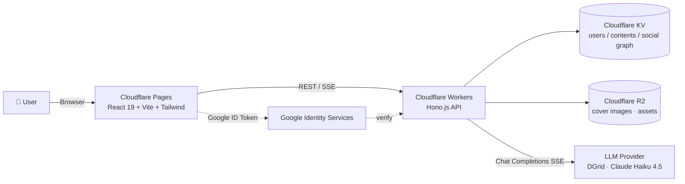

<div align="center">

# ✦ VibePop

**VibeCoding for Fun** — Create interactive social content with AI.

Talk to AI in natural language → get a playable mini-game / interactive card / micro-generator → publish and share in a TikTok-style vertical feed.

[](https://react.dev)
[](https://www.typescriptlang.org)
[](https://tailwindcss.com)
[](https://vitejs.dev)
[](https://hono.dev)
[](https://workers.cloudflare.com)

**[🚀 Live Demo](https://vibepop.pages.dev)** &nbsp;·&nbsp; **[📖 中文文档](./README.zh-CN.md)** &nbsp;·&nbsp; **[🗂 PRD](./docs/prd.md)**

</div>

---

## Why VibePop

- **🎨 Zero-code creation** — Describe it in plain language and the AI ships a runnable HTML/CSS/JS artifact. No IDE, no build step, no "what's a div".
- **⚡ Instant fun** — The creation loop itself is the entertainment: tweak → regenerate → share, all in seconds.
- **📱 Social-first distribution** — Browse interactive content like short videos; one tap to **Remix** any work as a starting point for your own.

## Features

| | |
|---|---|
| 🧭 **Dual-mode browsing** | Vertical feed (TikTok-style) + masonry list, same content, two vibes. |
| 🤖 **AI creation** | Streaming generation via SSE, multi-turn refinement, preset templates. |
| ♻️ **Remix** | One click to fork another creator's code as your starting canvas. |
| 💬 **Social loop** | Like · bookmark · comment · follow, all first-class. |
| 👤 **Profiles** | `@handle` routing, works grid, social graph. |
| 🔌 **Open API** | Agent-friendly endpoints so other tools can create & publish. |

## Architecture



- **Frontend** → Cloudflare Pages, SPA, Google OAuth via `@react-oauth/google`.
- **Backend** → Cloudflare Workers (Hono), JWT sessions, SSE streaming with keep-alive heartbeat.
- **Storage** → KV for data, R2 for binary assets.
- **AI** → OpenAI-compatible Chat Completions endpoint (pluggable via `AI_BASE_URL` / `AI_MODEL`).

## Tech Stack

**Frontend** — React 19 · TypeScript · Tailwind CSS v4 · React Router v7 · Zustand · Vite
**Backend** — Hono.js · Cloudflare Workers · Cloudflare KV · Cloudflare R2
**Auth** — Google Identity Services + JWT
**AI** — OpenAI-compatible Chat Completions over SSE

## Quick Start

**Prerequisites:** Node.js ≥ 18, a Cloudflare account (for production), a Google OAuth Web Client ID, an OpenAI-compatible API key.

### 1. Frontend

```bash
cd frontend
npm install
cp .env.local.example .env.local   # fill in VITE_GOOGLE_CLIENT_ID
npm run dev
```

→ open <http://localhost:5173>

### 2. Backend (Worker)

```bash
cd worker
npm install
cp .dev.vars.example .dev.vars     # fill in secrets below
npm run dev
```

→ API at <http://localhost:8787>

#### Required env vars (`worker/.dev.vars`)

| Key | Purpose |
|---|---|
| `JWT_SECRET` | Signing key for session JWTs |
| `AI_API_KEY` | OpenAI-compatible API key |
| `AI_BASE_URL` | e.g. `https://api.dgrid.ai/v1` |
| `AI_MODEL` | e.g. `anthropic/claude-haiku-4.5` |
| `GOOGLE_CLIENT_ID` | Google OAuth Web Client ID (must match frontend `VITE_GOOGLE_CLIENT_ID`) |

> `.dev.vars` is git-ignored — **never commit real secrets**. In production, inject them via `wrangler secret put <KEY>`.

## Project Structure

```
VibePop/
├── frontend/           # React SPA (Cloudflare Pages)
│   └── src/
│       ├── components/ # Reusable UI
│       ├── pages/      # Route-level screens
│       ├── stores/     # Zustand stores
│       ├── hooks/      # Custom hooks
│       ├── api/        # Typed API client
│       ├── i18n/       # zh / en strings
│       └── types/      # Shared TypeScript types
├── worker/             # Hono API on Cloudflare Workers
│   └── src/
│       ├── routes/     # HTTP routes (auth / content / ai / social ...)
│       ├── services/   # AI, templates, business logic
│       ├── middleware/ # Auth, seeding, error handling
│       └── seed.ts     # Schema migration + featured templates sync
└── docs/               # Product docs (PRD, deployment, prompt templates)
```

## Deployment

Production runs on Cloudflare (Workers + Pages + KV). Full guide: [`docs/deployment.md`](./docs/deployment.md).

One-shot release flow:

```bash
cd worker && npm run typecheck
cd ../frontend && npm run build
cd ../worker && npm run deploy
cd .. && npx wrangler pages deploy frontend/dist --project-name=vibepop --branch=main --commit-dirty=true
```

- **Frontend** — <https://vibepop.pages.dev>
- **API** — <https://vibepop-api.zyhh1611054604.workers.dev/api>

## Roadmap

- [ ] Rich media assets (audio / video clips referenced inside generated HTML)
- [ ] More prompt templates (quiz cards, daily-fortune generators, mini tools)
- [ ] Public Agent API + example integrations
- [ ] Analytics dashboard for creators
- [ ] Mobile-native wrapper (Capacitor / Expo)

## Contributing

VibePop is a weekend-vibes / side project — issues, discussion and PRs are all welcome.

1. Fork → create a feature branch (`feat/xxx` or `fix/xxx`).
2. Keep commits small and descriptive.
3. Run `npm run typecheck` in `worker/` and `npm run build` in `frontend/` before opening a PR.
4. Link the PR to an issue if one exists.

For product-level context before coding, skim [`docs/prd.md`](./docs/prd.md).

## Acknowledgements

Built on top of the wonderful work of the [React](https://react.dev), [Hono](https://hono.dev), [Tailwind CSS](https://tailwindcss.com), [Vite](https://vitejs.dev) and [Cloudflare Developer Platform](https://developers.cloudflare.com) communities.
