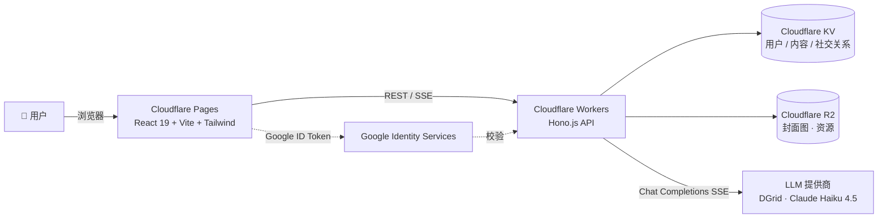

<div align="center">

# ✦ VibePop

**VibeCoding for Fun** —— 用 AI 创造互动式社交内容

用自然语言和 AI 聊天 → 生成一个能玩的小游戏 / 互动卡片 / 微生成器 → 发布并在短视频式的竖屏 Feed 里分享。

[](https://react.dev)
[](https://www.typescriptlang.org)
[](https://tailwindcss.com)
[](https://vitejs.dev)
[](https://hono.dev)
[](https://workers.cloudflare.com)

**[🚀 线上 Demo](https://vibepop.pages.dev)** &nbsp;·&nbsp; **[📖 English README](./README.md)** &nbsp;·&nbsp; **[🗂 PRD](./docs/prd.md)**

</div>

---

## 为什么做 VibePop

- **🎨 零门槛创作** —— 用一句话描述，AI 就给你一个可运行的 HTML/CSS/JS 作品。不需要 IDE、不需要编译、不需要问"div 是什么"。
- **⚡ 即时娱乐** —— 创作循环本身就是乐趣：调一下 → 重新生成 → 分享，全部以秒为单位。
- **📱 社交化分发** —— 像刷短视频一样浏览互动内容；一键 **Remix** 任何作品当做自己创作的起点。

## 功能亮点

| | |
|---|---|
| 🧭 **双模浏览** | 竖屏 Feed（短视频式）+ 瀑布流列表，同一批内容，两种氛围。 |
| 🤖 **AI 创作** | SSE 流式生成，多轮迭代，内置多个提示词模板。 |
| ♻️ **Remix** | 一键以他人作品为起点继续改编。 |
| 💬 **社交闭环** | 点赞 · 收藏 · 评论 · 关注，都是一等公民。 |
| 👤 **个人主页** | `@handle` 路由、作品网格、社交关系图。 |
| 🔌 **开放 API** | Agent 友好的接口，方便外部工具接入创作和发布。 |

## 架构



- **前端** → Cloudflare Pages，SPA，用 `@react-oauth/google` 做 Google 登录。
- **后端** → Cloudflare Workers（Hono），JWT 鉴权，SSE 流式输出 + 心跳保活。
- **存储** → KV 存结构化数据，R2 存二进制资源。
- **AI** → OpenAI 兼容 Chat Completions 接口（通过 `AI_BASE_URL` / `AI_MODEL` 可插拔切换）。

## 技术栈

**前端** — React 19 · TypeScript · Tailwind CSS v4 · React Router v7 · Zustand · Vite
**后端** — Hono.js · Cloudflare Workers · Cloudflare KV · Cloudflare R2
**鉴权** — Google Identity Services + JWT
**AI** — OpenAI 兼容 Chat Completions + SSE

## 快速开始

**前置条件：** Node.js ≥ 18；一个 Cloudflare 账号（生产部署用）；一个 Google OAuth Web 端 Client ID；一个 OpenAI 兼容的 API Key。

### 1. 前端

```bash
cd frontend
npm install
cp .env.local.example .env.local   # 填入 VITE_GOOGLE_CLIENT_ID
npm run dev
```

→ 打开 <http://localhost:5173>

### 2. 后端（Worker）

```bash
cd worker
npm install
cp .dev.vars.example .dev.vars     # 填入下面表格里的密钥
npm run dev
```

→ API 在 <http://localhost:8787>

#### 必需的环境变量（`worker/.dev.vars`）

| Key | 用途 |
|---|---|
| `JWT_SECRET` | 给会话 JWT 签名用 |
| `AI_API_KEY` | OpenAI 兼容的 API Key |
| `AI_BASE_URL` | 如 `https://api.dgrid.ai/v1` |
| `AI_MODEL` | 如 `anthropic/claude-haiku-4.5` |
| `GOOGLE_CLIENT_ID` | Google OAuth Web 端 Client ID（需要和前端 `VITE_GOOGLE_CLIENT_ID` 保持一致） |

> `.dev.vars` 已被 `.gitignore` 忽略，**切勿提交真实密钥**。生产环境通过 `wrangler secret put <KEY>` 注入。

## 项目结构

```
VibePop/
├── frontend/           # React SPA（Cloudflare Pages）
│   └── src/
│       ├── components/ # 可复用 UI
│       ├── pages/      # 路由级页面
│       ├── stores/     # Zustand 状态
│       ├── hooks/      # 自定义 Hooks
│       ├── api/        # 类型化 API 客户端
│       ├── i18n/       # zh / en 文案
│       └── types/      # 共享 TypeScript 类型
├── worker/             # 跑在 Cloudflare Workers 上的 Hono API
│   └── src/
│       ├── routes/     # HTTP 路由（auth / content / ai / social ...）
│       ├── services/   # AI、模板、业务逻辑
│       ├── middleware/ # 鉴权、seed、错误处理
│       └── seed.ts     # Schema 迁移 + 精选模板同步
└── docs/               # 产品文档（PRD、部署说明、Prompt 模板）
```

## 部署

生产环境部署到 Cloudflare（Workers + Pages + KV）。完整流程见 [`docs/deployment.md`](./docs/deployment.md)。

日常一键发版：

```bash
cd worker && npm run typecheck
cd ../frontend && npm run build
cd ../worker && npm run deploy
cd .. && npx wrangler pages deploy frontend/dist --project-name=vibepop --branch=main --commit-dirty=true
```

- **前端** — <https://vibepop.pages.dev>
- **API** — <https://vibepop-api.zyhh1611054604.workers.dev/api>

## Roadmap

- [ ] 富媒体素材（生成内容里直接引用音频 / 视频片段）
- [ ] 更多 prompt 模板（问答卡、每日运势生成器、小工具）
- [ ] 公开 Agent API + 示例接入
- [ ] 创作者数据看板
- [ ] 移动端原生壳（Capacitor / Expo）

## 参与贡献

VibePop 是一个 "周末 vibes" 性质的副业项目 —— 欢迎 Issue、讨论和 PR。

1. Fork → 新建一个 feature 分支（`feat/xxx` 或 `fix/xxx`）。
2. 保持 commit 小而有描述性。
3. 在开 PR 前，`worker/` 里跑 `npm run typecheck`、`frontend/` 里跑 `npm run build`。
4. 如有对应 Issue，在 PR 里关联一下。

开工前想了解产品背景，可以先翻一下 [`docs/prd.md`](./docs/prd.md)。

## 致谢

站在这些优秀社区的肩膀上：[React](https://react.dev)、[Hono](https://hono.dev)、[Tailwind CSS](https://tailwindcss.com)、[Vite](https://vitejs.dev) 和 [Cloudflare Developer Platform](https://developers.cloudflare.com)。
